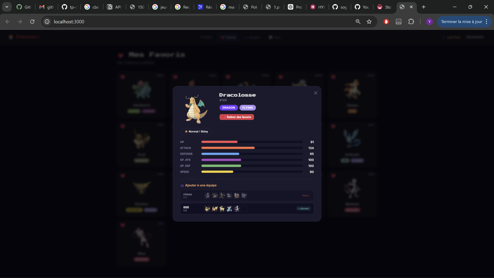
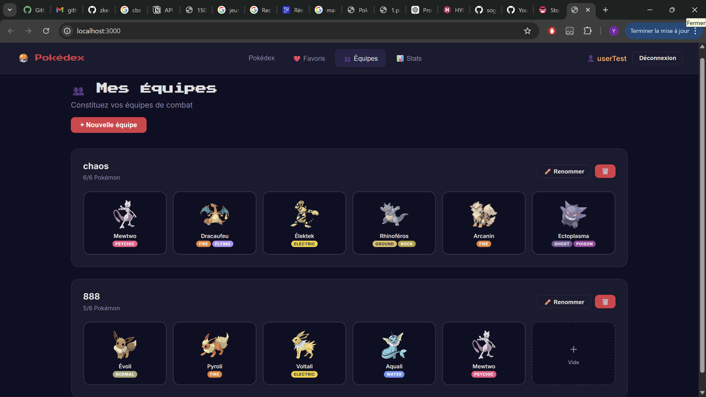

# 🔴 Pokédex API — TP NoSQL

> API REST complète des 151 Pokémon de la 1ère génération, avec interface web intégrée et système d'authentification JWT.


**Status** : ✅ **Complet** — Toutes les 6 parties + frontend implémentés et fonctionnels.

---

## 📋 Table des matières

- [Fonctionnalités](#-fonctionnalités)
- [Prérequis](#-prérequis)
- [Installation](#-installation)
- [Lancement](#-lancement)
- [Structure](#-structure-du-projet)
- [API Endpoints](#-api-endpoints)
- [Authentification](#-authentification)
- [Screenshots](#-screenshots)
- [Technologies](#-technologies)

---

## ✨ Fonctionnalités

### 🔧 Backend — 6 parties TP

**Partie 1-3 : CRUD & Routes Express**
- ✅ CRUD complet (Create, Read, Update, Delete)
- ✅ Routes organisées avec Express Router
- ✅ Gestion des erreurs (try/catch)
- ✅ Statuts HTTP corrects (201, 204, 404, 401, 500)

**Partie 4 : Filtres, Tri & Pagination**
- ✅ Filtrer par `?type=Fire`
- ✅ Rechercher par `?name=pika` (regex, case-insensitive)
- ✅ Trier par `?sort=-base.Attack`
- ✅ Paginer avec `?page=2&limit=20`
- ✅ Métadonnées pagination (total, totalPages)
- ✅ Tous les paramètres se combinent

**Partie 5 : Authentification JWT**
- ✅ `POST /api/auth/register` — Inscription (pre-save bcrypt)
- ✅ `POST /api/auth/login` — Connexion (JWT 24h)
- ✅ Middleware JWT (vérification token)
- ✅ Routes protégées (POST/PUT/DELETE)
- ✅ Routes publiques (GET)

**Partie 6 : Fonctionnalités bonus**
- ✅ **6.A** — Favoris ($addToSet, $pull)
- ✅ **6.B** — Statistiques (agrégation MongoDB)
- ✅ **6.C** — Validation (types enum, stats 1-255, messages FR)
- ✅ **6.D** — Équipes (CRUD, max 6 Pokémon, populate)

### 🖥️ Frontend — SPA Vanilla JS

- ✅ **Pokédex** : grille responsive, filtres/tri/pagination temps réel
- ✅ **Mode Shiny** : toggle sprites alternatifs
- ✅ **Fiche détaillée** : stats avec barres visuelles
- ✅ **Favoris** : cœurs visuels, persistance utilisateur
- ✅ **Équipes** : gestion 6 slots par équipe
- ✅ **Statistiques** : compteur animé, records, graphiques
- ✅ **Authentification** : login/register modals, toggle mot de passe 👁️
- ✅ **Auto-logout** : détection 401, suppression token expiré
- ✅ **Design** : thème sombre Pokémon, responsive, animations fluides

---

## 📦 Prérequis

- **Node.js** v18+
- **MongoDB** local ou [Atlas](https://www.mongodb.com/atlas) (gratuit)
- **npm**

---

## 🚀 Installation

### 1. Cloner

```bash
git clone https://github.com/sogoyou8/API-pokemon-NoSQL.git
cd tp-nosql-sogoyou8
```

### 2. Installer dépendances

```bash
npm install
```

### 3. Configurer `.env`

```bash
cp .env.example .env
```

Vérifiez que `.env` contient :
```env
PORT=3000
MONGODB_URI=mongodb://localhost:27017/pokemons
API_URL=http://localhost:3000
JWT_SECRET=7bf651e6a0c2ec2cf4a4815602758ff4ad1dfb58715a284a01ad8b742838dc97dbe3ca06310e01d181a64d2e013f1c4c
```

---

## ▶️ Lancement

### Importer les 151 Pokémon (une seule fois)

```bash
npm run seed
```

**Résultat** :
```
Connecté à MongoDB !
Collection vidée.
151 Pokémon insérés avec succès !
Connexion fermée.
```

### Lancer le serveur

```bash
npm run dev
```

Accès : **http://localhost:3000**

### Vérifications

```bash
# Tester l'API
curl http://localhost:3000/api/pokemons?limit=3

# Mongosh
mongosh
> use pokemons
> db.pokemons.countDocuments()      # → 151
> db.pokemons.findOne({ id: 25 })  # → Pikachu
```

---

## 📁 Structure du projet

```
tp-nosql-sogoyou8/
├── index.js                    ← Serveur Express
├── package.json
├── .env & .env.example
│
├── db/
│   ├── connect.js              ← Connexion Mongoose
│   └── seed.js                 ← Import 151 Pokémon
│
├── models/
│   ├── pokemon.js              ← Schéma avec validation
│   ├── user.js                 ← Pre-save bcrypt, favoris
│   └── team.js                 ← Équipes (max 6)
│
├── middleware/
│   └── auth.js                 ← Vérification JWT
│
├── routes/
│   ├── pokemons.js             ← CRUD + filtres/tri/pagination
│   ├── auth.js                 ← Register + Login
│   ├── favorites.js            ← GET/POST/DELETE
│   ├── teams.js                ← CRUD avec populate
│   └── stats.js                ← Agrégation MongoDB
│
├── data/
│   ├── pokemonsList.js         ← 151 Pokémon source
│   └── pokemons.json           ← JSON généré
│
├── assets/pokemons/
│   ├── 1.png … 151.png         ← Sprites normaux
│   └── shiny/1.png … 151.png   ← Sprites shiny
│
└── public/
    ├── index.html
    ├── css/style.css
    └── js/app.js
```

---

## 🔗 API Endpoints

### Pokémon

| Méthode | Route | Auth | Status | Description |
|---------|-------|------|--------|-------------|
| `GET` | `/api/pokemons` | ✅ Non | 200 | Lister (avec filtres/tri/pagination) |
| `GET` | `/api/pokemons/:id` | ✅ Non | 200/404 | Détail |
| `POST` | `/api/pokemons` | 🔒 Oui | 201 | Créer |
| `PUT` | `/api/pokemons/:id` | 🔒 Oui | 200/404 | Modifier |
| `DELETE` | `/api/pokemons/:id` | 🔒 Oui | 204/404 | Supprimer |

**Query Parameters** :
```
?type=Fire&name=pika&sort=-base.Attack&page=2&limit=20
```

| Paramètre | Exemple | Description |
|-----------|---------|-------------|
| `type` | `Fire` | Filtre par type |
| `name` | `pika` | Recherche par nom |
| `sort` | `-base.HP` | Tri (- = desc) |
| `page` | `2` | Numéro de page |
| `limit` | `20` | Résultats par page |

---

### Authentification

| Méthode | Route | Description |
|---------|-------|-------------|
| `POST` | `/api/auth/register` | Inscription |
| `POST` | `/api/auth/login` | Connexion → JWT |

**Register** :
```bash
curl -X POST http://localhost:3000/api/auth/register \
  -H "Content-Type: application/json" \
  -d '{"username": "sacha", "password": "pikachu123"}'
# → 201 { "message": "Utilisateur sacha créé avec succès." }
```

**Login** :
```bash
curl -X POST http://localhost:3000/api/auth/login \
  -H "Content-Type: application/json" \
  -d '{"username": "sacha", "password": "pikachu123"}'
# → 200 { "token": "eyJ..." }
```

**Utiliser token** :
```bash
curl -X POST http://localhost:3000/api/pokemons \
  -H "Authorization: Bearer <token>" \
  -d '{"id": 152, ...}'
```

---

### Favoris (Authentifié)

| Méthode | Route | Description |
|---------|-------|-------------|
| `GET` | `/api/favorites` | Lister mes favoris |
| `POST` | `/api/favorites/:pokemonId` | Ajouter |
| `DELETE` | `/api/favorites/:pokemonId` | Retirer |

---

### Équipes (Authentifié)

| Méthode | Route | Max | Description |
|---------|-------|-----|-------------|
| `GET` | `/api/teams` | — | Lister (populate) |
| `POST` | `/api/teams` | 6 | Créer |
| `PUT` | `/api/teams/:id` | 6 | Modifier |
| `DELETE` | `/api/teams/:id` | — | Supprimer |

---

### Statistiques

| Méthode | Route | Auth | Description |
|---------|-------|------|-------------|
| `GET` | `/api/stats` | ✅ Non | Agrégation complète |

---

## 🔐 Authentification

### Fonctionnement

1. **Register** : hash mdp (pre-save bcrypt) → création user
2. **Login** : vérification bcrypt → JWT signé (24h)
3. **Usage** : header `Authorization: Bearer <token>`
4. **Verify** : middleware auth.js → 401 si invalide/expiré

### Routes protégées

| Route | Auth requise |
|-------|--------------|
| `GET /api/pokemons` | ✅ Non |
| `GET /api/pokemons/:id` | ✅ Non |
| `POST /api/pokemons` | 🔒 Oui |
| `PUT /api/pokemons/:id` | 🔒 Oui |
| `DELETE /api/pokemons/:id` | 🔒 Oui |
| `GET/POST/DELETE /api/favorites/*` | 🔒 Oui |
| `GET/POST/PUT/DELETE /api/teams/*` | 🔒 Oui |
| `GET /api/stats` | ✅ Non |

**Compte test** :
```
Username: userTest
Password: Passwordtest
```

---

## 🖼️ Screenshots

<p align="center">
  
  
  
</p>

<p align="center">
  
  
</p>

---

## 🛠️ Technologies

### Backend
- **Express.js** — Serveur REST
- **MongoDB + Mongoose** — BD & ODM
- **bcrypt** — Hash sécurisé
- **JWT** — Auth token
- **CORS** — Origines croisées
- **dotenv** — Env vars

### Frontend
- **Vanilla JS** — SPA sans framework
- **CSS3** — Thème sombre, animations, responsive
- **Fetch API** — Requêtes async
- **LocalStorage** — Persistance token

### Outils
- **nodemon** — Hot-reload
- **mongosh** — CLI MongoDB
- **Git** — Versioning

---

## 📝 Scripts

| Commande | Description |
|----------|-------------|
| `npm run dev` | Serveur avec nodemon |
| `npm run seed` | Import 151 Pokémon |

---

## ✅ Checklist complète

- [x] Partie 1 : Routes Express GET/POST/PUT/DELETE
- [x] Partie 2 : MongoDB + Mongoose + Seed
- [x] Partie 3 : CRUD complet + erreurs
- [x] Partie 4 : Filtres + tri + pagination
- [x] Partie 5 : Auth JWT (register/login)
- [x] Partie 6.A : Favoris
- [x] Partie 6.B : Stats (agrégation)
- [x] Partie 6.C : Validation (enum, range, FR)
- [x] Partie 6.D : Équipes (CRUD + populate)
- [x] Frontend : UI complète + SPA

---

**Bon jeu ! 🎮**