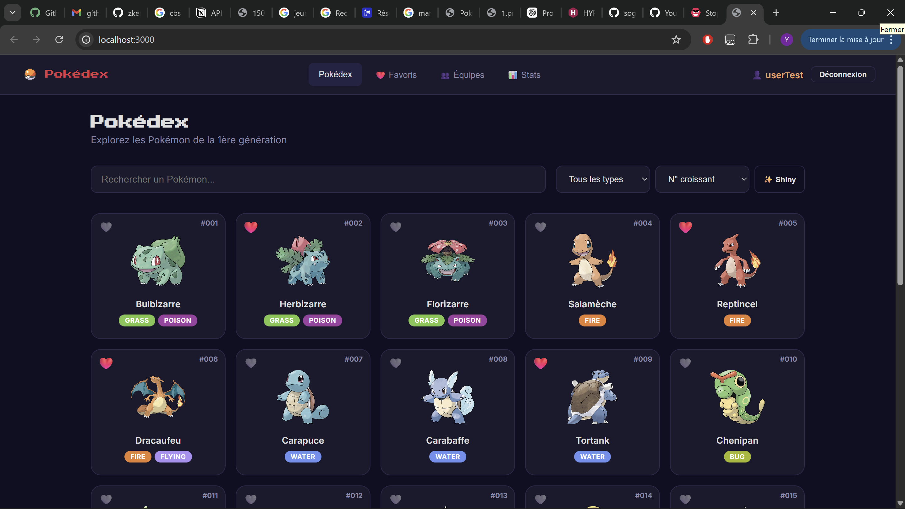
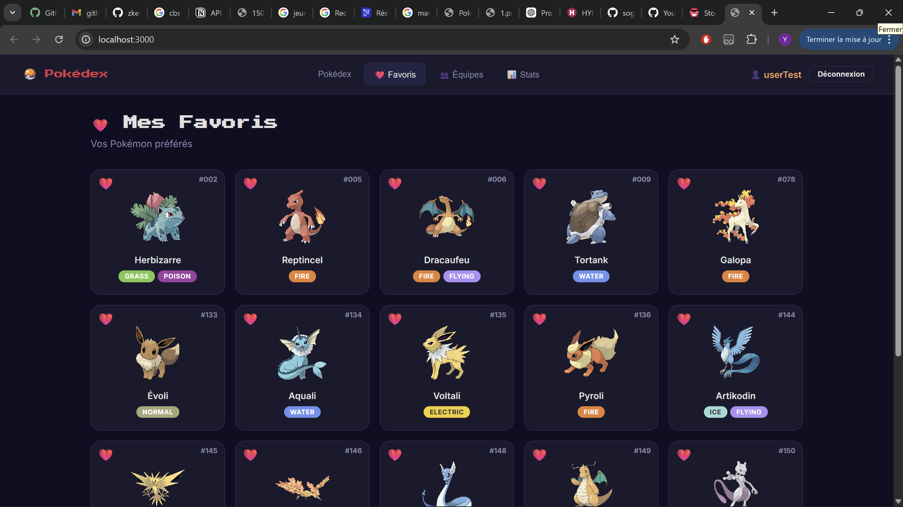
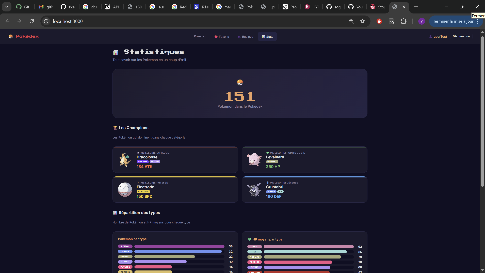

# 🔴 Pokédex API — TP NoSQL

> API REST complète des 151 Pokémon de la 1ère génération, avec interface web intégrée.


## 📋 Table des matières

- [Fonctionnalités](#-fonctionnalités)
- [Prérequis](#-prérequis)
- [Installation](#-installation)
- [Lancement](#-lancement)
- [Structure du projet](#-structure-du-projet)
- [API Endpoints](#-api-endpoints)
- [Authentification](#-authentification)
- [Frontend](#-frontend)
- [Technologies](#-technologies)

---

## ✨ Fonctionnalités

### Backend (API REST)
- **CRUD complet** sur les Pokémon (Create, Read, Update, Delete)
- **Filtres avancés** : par type, par nom (recherche partielle insensible à la casse)
- **Tri** : par n°, nom, stats (croissant/décroissant)
- **Pagination** : `page` + `limit` avec métadonnées (`total`, `totalPages`)
- **Authentification JWT** : inscription, connexion, protection des routes sensibles
- **Favoris** : ajouter/retirer/lister des Pokémon favoris (par utilisateur)
- **Équipes** : créer/modifier/supprimer des équipes de 6 Pokémon max (avec `populate`)
- **Statistiques** : agrégation MongoDB (nombre par type, moyennes HP, records, moyennes globales)
- **Validation** : types autorisés, stats entre 1-255, messages d'erreur en français

### Frontend (SPA)
- **Pokédex** : grille de Pokémon avec recherche, filtres, tri, pagination
- **Mode Shiny** : toggle pour afficher les sprites shiny
- **Fiche détaillée** : stats avec barres visuelles, ajout aux équipes depuis la fiche
- **Favoris** : gestion visuelle avec cœurs sur les cartes
- **Équipes** : interface drag & drop style, 6 slots par équipe
- **Statistiques** : page avec compteur animé, records, graphiques par type, moyennes globales
- **Design** : thème sombre Pokémon, responsive, animations fluides

---

## 📦 Prérequis

- **Node.js** v18 ou supérieur
- **MongoDB** en local (`mongod`) ou [MongoDB Atlas](https://www.mongodb.com/atlas) (gratuit)
- **npm** (inclus avec Node.js)

---

## 🚀 Installation

```bash
# 1. Cloner le repository
git clone <url-du-repo>
cd tp-nosql-sogoyou8

# 2. Installer les dépendances
npm install

# 3. Configurer l'environnement
cp .env.example .env
```

Éditez le fichier `.env` si nécessaire :

```env
PORT=3000
MONGODB_URI=mongodb://localhost:27017/pokemons
API_URL=http://localhost:3000
JWT_SECRET=supersecretkey_pokemon_2026
```

---

## ▶️ Lancement

```bash
# Importer les 151 Pokémon dans MongoDB (à faire une fois)
npm run seed

# Lancer le serveur en mode développement
npm run dev
```

Le serveur démarre sur `http://localhost:3000`.

### Vérification rapide

```bash
# Vérifier que l'API répond
curl http://localhost:3000/api/pokemons?limit=3

# Vérifier dans mongosh
mongosh
> use pokemons
> db.pokemons.countDocuments()   // → 151
```

---

## 📁 Structure du projet

```
tp-nosql-sogoyou8/
├── index.js                 ← Point d'entrée Express
├── package.json
├── .env                     ← Variables d'environnement
├── .env.example
│
├── db/
│   ├── connect.js           ← Connexion MongoDB via Mongoose
│   └── seed.js              ← Script d'import des 151 Pokémon
│
├── models/
│   ├── pokemon.js           ← Schéma Pokémon (validation avancée)
│   ├── user.js              ← Schéma User (avec favoris)
│   └── team.js              ← Schéma Équipe (ref → Pokemon, max 6)
│
├── middleware/
│   └── auth.js              ← Middleware JWT (vérification du token)
│
├── routes/
│   ├── pokemons.js          ← CRUD Pokémon + filtres/tri/pagination
│   ├── auth.js              ← Register + Login (JWT)
│   ├── favorites.js         ← Gestion des favoris
│   ├── teams.js             ← CRUD Équipes (avec populate)
│   └── stats.js             ← Statistiques par agrégation
│
├── data/
│   ├── pokemonsList.js      ← Données brutes des 151 Pokémon
│   ├── pokemons.json        ← Données JSON générées
│   └── generatePokemonsJson.js
│
├── assets/
│   └── pokemons/
│       ├── 1.png … 151.png  ← Sprites normaux
│       └── shiny/           ← Sprites shiny
│
└── public/                  ← Frontend (SPA)
    ├── index.html
    ├── css/style.css
    └── js/app.js
```

---

## 🔗 API Endpoints

### Pokémon

| Méthode | Route | Auth | Description |
|---------|-------|------|-------------|
| `GET` | `/api/pokemons` | ❌ | Lister les Pokémon (filtres, tri, pagination) |
| `GET` | `/api/pokemons/:id` | ❌ | Détail d'un Pokémon |
| `POST` | `/api/pokemons` | ✅ | Créer un Pokémon |
| `PUT` | `/api/pokemons/:id` | ✅ | Modifier un Pokémon |
| `DELETE` | `/api/pokemons/:id` | ✅ | Supprimer un Pokémon |

#### Query parameters (GET /api/pokemons)

| Paramètre | Exemple | Description |
|-----------|---------|-------------|
| `type` | `?type=Fire` | Filtrer par type |
| `name` | `?name=pika` | Recherche par nom (insensible à la casse) |
| `sort` | `?sort=-base.Attack` | Trier (préfixe `-` = décroissant) |
| `page` | `?page=2` | Numéro de page (défaut: 1) |
| `limit` | `?limit=20` | Résultats par page (défaut: 50) |

#### Format de réponse paginée

```json
{
  "data": [{ "id": 1, "name": { "french": "Bulbizarre" }, ... }],
  "page": 1,
  "limit": 24,
  "total": 151,
  "totalPages": 7
}
```

### Authentification

| Méthode | Route | Description |
|---------|-------|-------------|
| `POST` | `/api/auth/register` | Inscription (username + password) |
| `POST` | `/api/auth/login` | Connexion → retourne un JWT |

#### Exemples

```bash
# Inscription
curl -X POST http://localhost:3000/api/auth/register \
  -H "Content-Type: application/json" \
  -d '{"username": "sacha", "password": "pikachu123"}'

# Connexion
curl -X POST http://localhost:3000/api/auth/login \
  -H "Content-Type: application/json" \
  -d '{"username": "sacha", "password": "pikachu123"}'
# → { "token": "eyJhbGciOi..." }
```

### Favoris (authentifié)

| Méthode | Route | Description |
|---------|-------|-------------|
| `GET` | `/api/favorites` | Lister mes favoris |
| `POST` | `/api/favorites/:pokemonId` | Ajouter un favori |
| `DELETE` | `/api/favorites/:pokemonId` | Retirer un favori |

### Équipes (authentifié)

| Méthode | Route | Description |
|---------|-------|-------------|
| `GET` | `/api/teams` | Lister mes équipes |
| `GET` | `/api/teams/:id` | Détail d'une équipe (avec populate) |
| `POST` | `/api/teams` | Créer une équipe |
| `PUT` | `/api/teams/:id` | Modifier une équipe |
| `DELETE` | `/api/teams/:id` | Supprimer une équipe |

### Statistiques

| Méthode | Route | Auth | Description |
|---------|-------|------|-------------|
| `GET` | `/api/stats` | ❌ | Statistiques avec agrégation MongoDB |

#### Données retournées

- `totalPokemons` — Nombre total de Pokémon
- `countByType` — Nombre de Pokémon par type (agrégation `$group`)
- `avgHPByType` — HP moyen par type (agrégation `$avg`)
- `globalAvg` — Moyennes globales (HP, Attack, Defense, Speed)
- `highestAttack` — Pokémon avec la plus haute attaque
- `highestHP` — Pokémon avec le plus de HP
- `fastestPokemon` — Pokémon le plus rapide
- `highestDefense` — Pokémon avec la meilleure défense

---

## 🔐 Authentification

L'API utilise **JWT (JSON Web Token)** pour l'authentification.

1. **Inscription** via `POST /api/auth/register` (le mot de passe est hashé avec bcrypt)
2. **Connexion** via `POST /api/auth/login` → retourne un token JWT (valide 24h)
3. **Utilisation** : ajouter le header `Authorization: Bearer <token>` aux requêtes protégées

Les routes `GET` sont publiques. Les routes `POST`, `PUT`, `DELETE` sur les Pokémon sont protégées. Les favoris et équipes nécessitent une authentification.

### Compte de test

```
Username: userTest
mdp: Passwordtest
```

## Screenshots

<p align="center">
  
  

</p>

<p align="center">
  
  
</p>